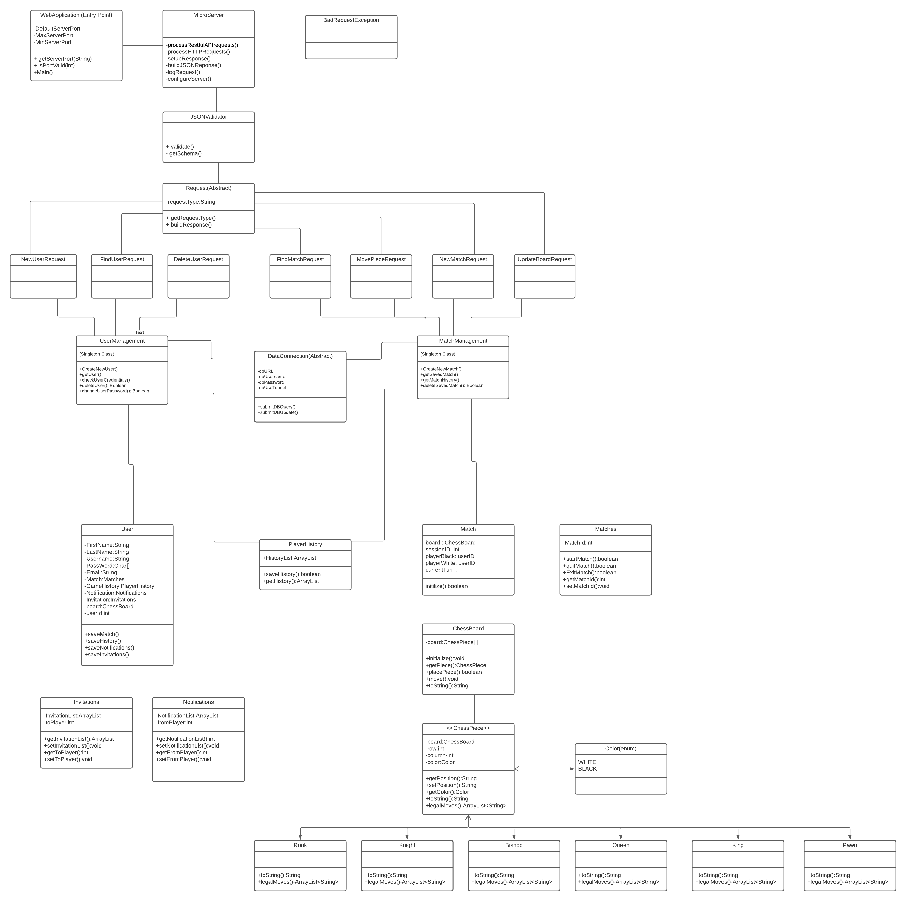

## CRC Cards -Additions and Changes from P1

| Platform | |
|------------|-------------|
| Host matches | Game |
| Record match history | History |
| Allow users to find each other | User Communication |

| UserManagement | |
|------------|-----------|
| Registration/New User | DataConnection |
| Retrieve Stored User | DataConnection |
| Delete Stored Users | DataConnection |
| Upadate/Change User Info | DataConnection |
| Authenticate Users | DataConnection |

| DataConnection | |
| ----------------|--------|
|Interact directly with datasource |   |

| User | |
|---------------------|---------|
|Store user specific info | |

| MatchManagement | |
|------------|-------------|
| Create a match | Game |
| Invite player to a match | User Communication |
| Accept/reject invitation to a match | User Communication |
| Manage multiple matches simultaneously | User Profile |
| Delete a match | Game |
| Update match status | Game Status | 

| Game | |
|------------|-------------|
| Displays gameboard | |
| Wait for another player to join | Rules |
| Prohibit too many players from joining | Rules | 
| Keep track of whose turn it is/ Save match progress | Match Status |
| Ensure game move is legal | Rules |
| Notify players of winner | Match Status |
| Upload final statistics after match completion | History |

| User Communication | |
|------------|-------------|
| Manage game invitations | |
| Allow users to search for one another | |

| History | |
|------------|-------------|
| Track match history | MatchManagement |
| Calculate match statistics | MatchManagement |

| User Profile | |
|------------|-------------|
| Display user credentials | UserManagement |
| Allow user to unregister | UserManagement |
| Display match history | History |
| Provides access to matches in progress | MatchManagement |

| Rules | |
|------------|-------------|
| Contain ruleset for given game | Game |
| Ensure correct number of players before match start | Game |

| Match Status | |
|------------|-------------|
| Track each match's status | Game |
| Track all game moves | History |
## Class Diagram

